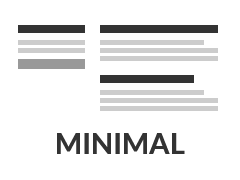

# nickdanis

This site uses a modified version of the **minimal** theme available below:

*Minimal is a Jekyll theme for GitHub Pages. You can [preview the theme to see what it looks like](http://pages-themes.github.io/minimal), or even [use it today](#usage).*



To test local build:

```
bundle exec jekyll serve --watch
```
