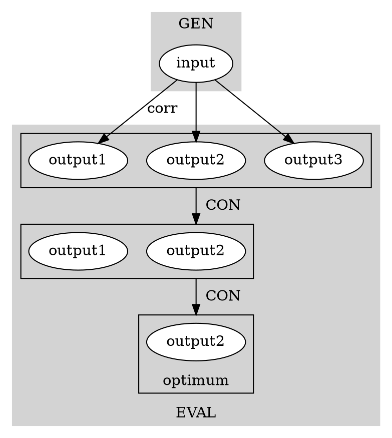

```graphviz
digraph G {
    compound=true;
    rankdir=TB;

  subgraph cluster_gen {
    style=filled;
    color=lightgrey;
    node [style=filled,fillcolor=white];
    label = "GEN";
    input;
  }

  subgraph cluster_eval {
    label = "EVAL";
    labelloc=b;
    style=filled;
    color=lightgrey;
    node [style=filled,fillcolor=white];

    subgraph cluster_st1 {
        label="";
        style=square;
        color=black;
        output1;
        output2;
        output3;
    }
    subgraph cluster_st2 {
        label="";
        style=square;
        color=black;
        output4;
        output5;
    }
    subgraph cluster_st3 {
        label="optimum";
        style=square;
        color=black;
        output6;
    }
    input -> output1 [label="corr"];
    input -> output2;
    input -> output3;
    output2 -> output4 [label="  CON", ltail=cluster_st1, lhead=cluster_st2];
    output4 -> output6 [label="  CON", ltail=cluster_st2, lhead=cluster_st3];
    output6 [label="output2"];
    output4 [label="output2"];
    output5 [label="output1"];
  }
}
```